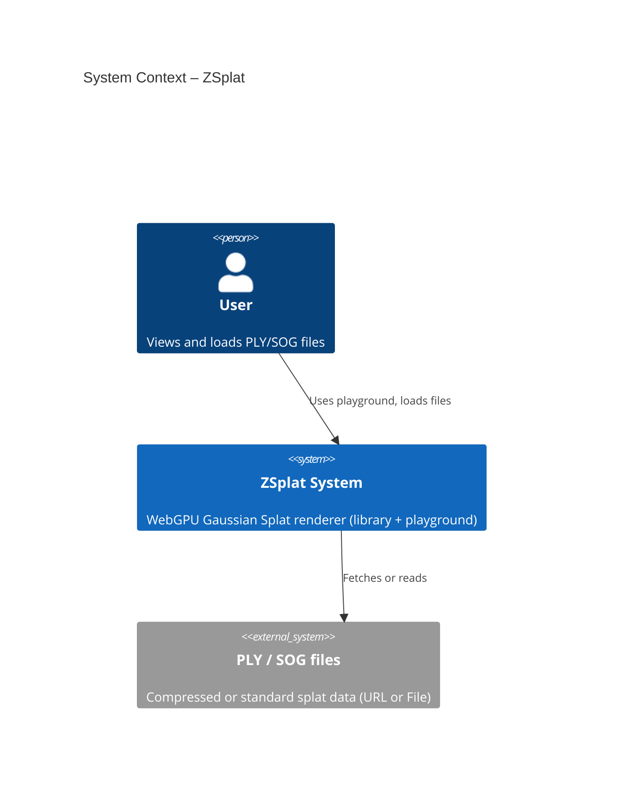
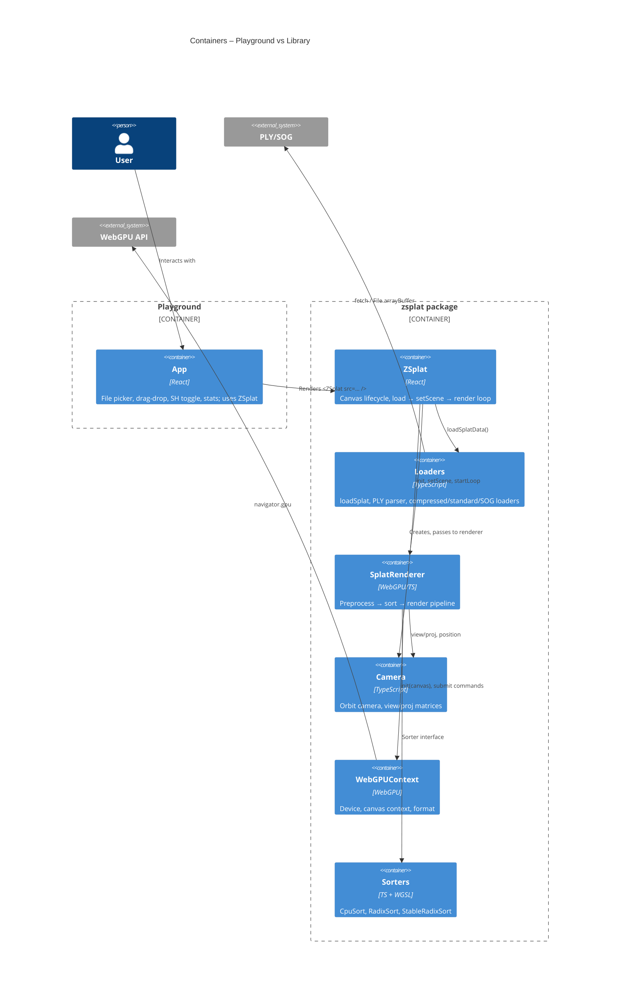
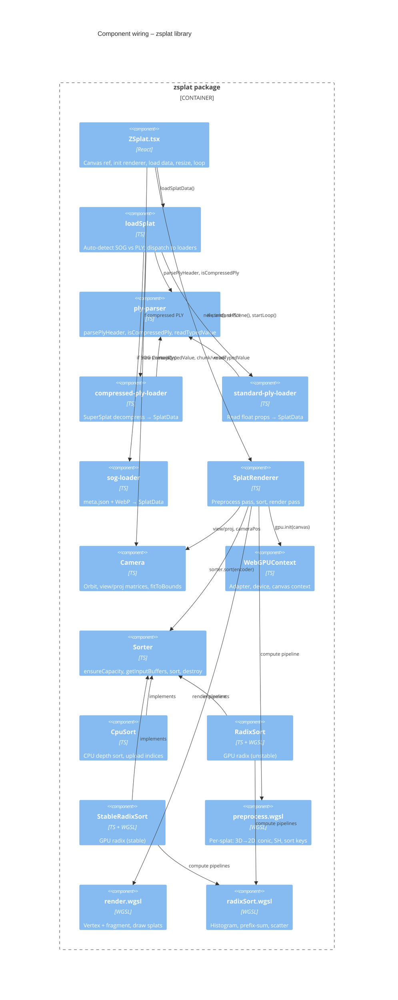
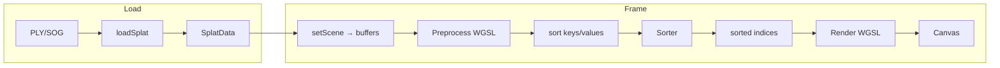

# ZSplat – C4 wiring

How the project is wired: context, containers, and components.

## Level 1 – System Context

## Level 2 – Containers

## Level 3 – Components (library wiring)

## Data flow (runtime)

- **Preprocess**: reads positions, rotations, scales, colors, SH from GPU buffers; writes `splatOut` (conic, NDC) and sort keys/values.
- **Sorter**: consumes keys (depth) and values (splat index); returns buffer of sorted indices.
- **Render**: reads `splatOut` and sorted indices; draws 6 vertices per splat, fragment shader evaluates Gaussian.
